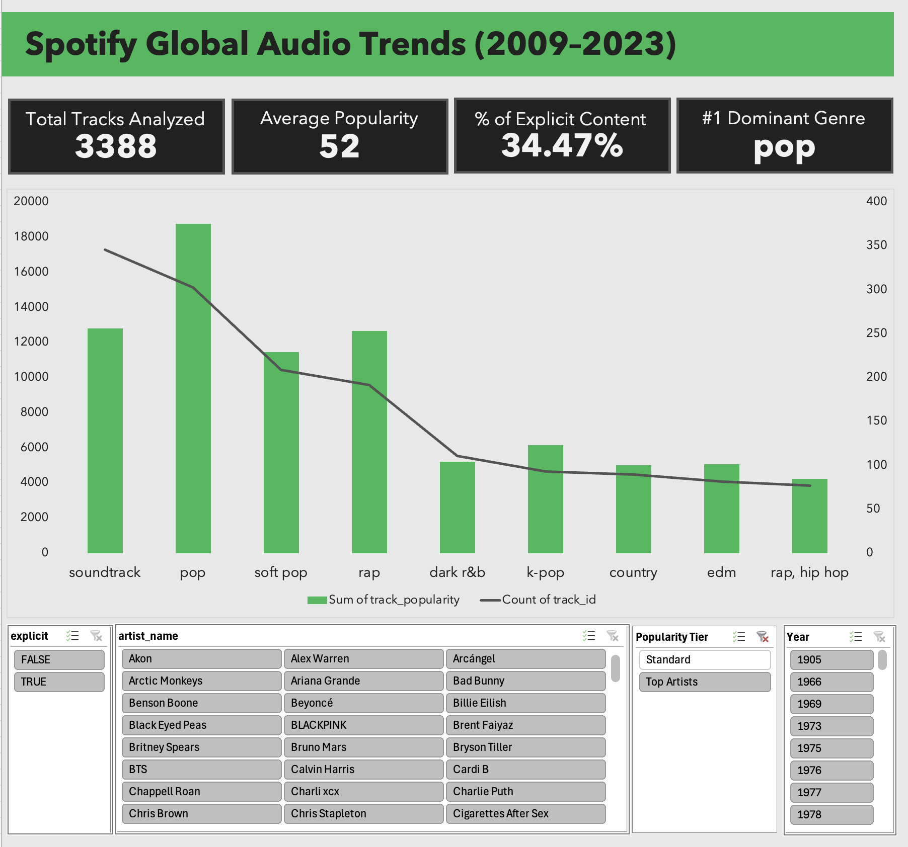

# Spotify Global Audio Trends Dashboard (2009–2025)
## Project Overview
This interactive Excel dashboard analyzes a dataset of over 8,700 global Spotify tracks to uncover macro trends in music popularity, content rating distribution, and genre dominance. 

Rather than serving as a basic static report, this project was engineered with a **three-tier architecture** and advanced user-experience (UX) features to function like a native business intelligence app. It enables stakeholders to instantly isolate individual artists, track release eras, and filter content profiles.



---

## Key Technical Skills Demonstrated
* **Advanced Data Cleaning & Transformation:** Handled malformed string parsing (removing bracketed code footprints), standardized categorical metadata, and removed structural anomalies (`-` and empty records) at the source.
* **UX Performance Engineering:** Implemented logical helper columns to create a "Cascading Slicer" architecture, mitigating high-cardinality cognitive load for the end-user.
* **Three-Tier Architecture Design:** Enforced strict separation of concerns by partitioning the raw data, the analytical pivot engine, and the visual UI canvas across dedicated worksheets.
* **Sheet Architecture & Security:** Configured explicit element protection, disabling asset manipulation while natively preserving background PivotTable caching and Slicer interaction privileges.

---

## System Architecture & Data Pipeline

The project is built around a streamlined, clean database engine optimized for quick analytical recalibration:

```text
[Raw Data: 8.7k+ Rows] ──> [Headline Pivot Engines] ──> [Dynamic KPI Cards]
                             └──> [Value Filters]     ──> [Global Benchmark Combo Chart]

Data from https://www.kaggle.com/datasets/wardabilal/spotify-global-music-dataset-20092025
